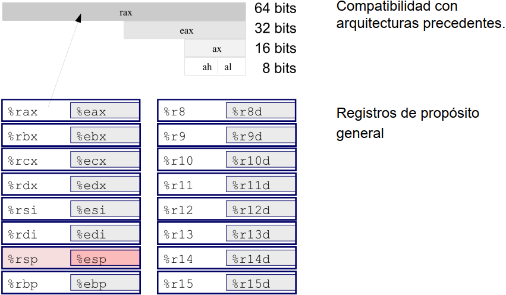
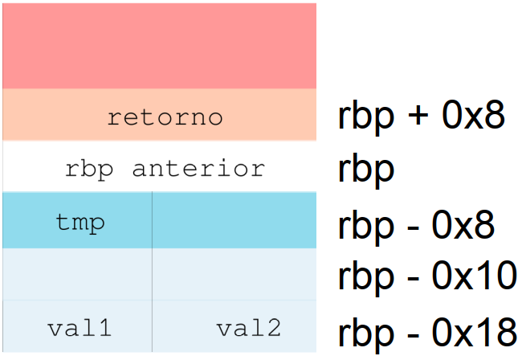
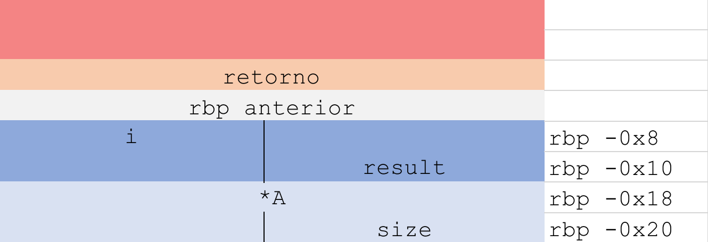
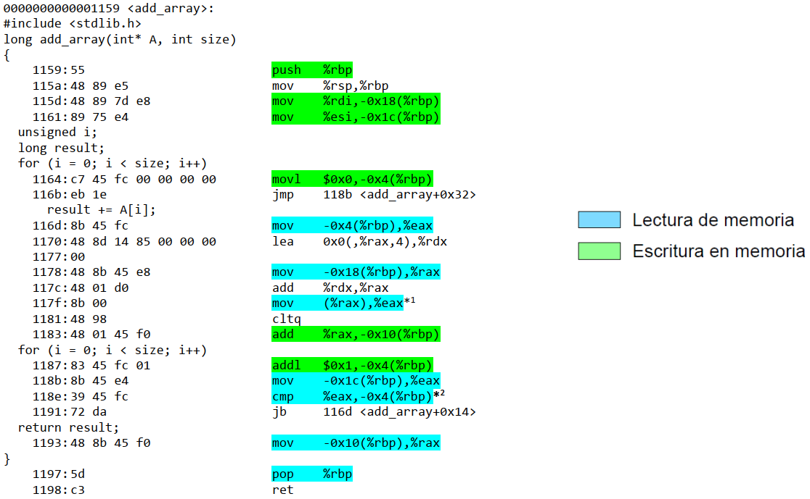
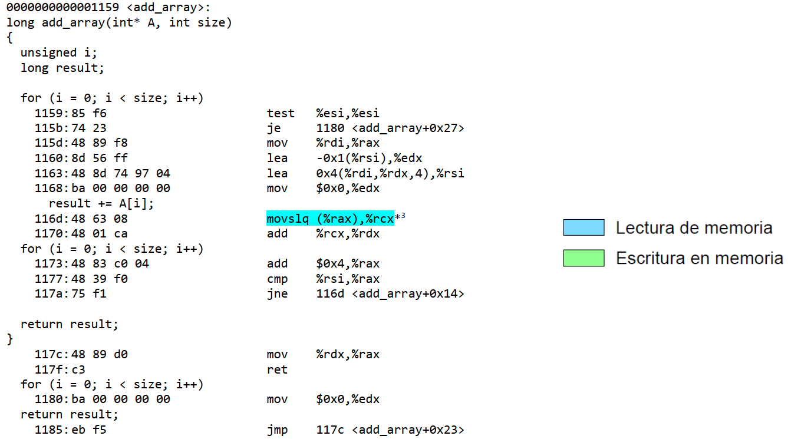

## Sesión II Monitorización del rendimiento en tiempo de ejecución

La tecnología de desarrollo de los compiladores hace hoy posible obtener un alto grado de optimización en el código generado, haciendo completamente innecesario trabajar a nivel ensamblador de forma manual.<br>

Sin embargo, las buenas soluciones siguen lejos de obtenerse con la simple pulsación de un botón. Por ejemplo, muchas de las optimizaciones que puede realizar el compilador deben indicarse expresamente entre los parámetros de la compilación, y no se incluyen como opciones por defecto. En otras ocasiones el patrón de acceso a la memoria utilizado por la aplicación no se adapta a la arquitectura sobre la que debe ejecutarse el código, por lo que la mejora está fuera del alcance del propio compilador.<br>

El propósito de esta práctica es entender el funcionamiento del compilador y la manera en la que las funciones se ejecutan sobre la arquitectura. Sigue para ello el guion que se describe a continuación, y contesta a cada una de las cuestiones que se remarcan en negrita.

---

##### Objetivos

- Entender la relación entre el código binario del programa y la arquitectura a través del ABI (Application Binary Interface)
- Analizar el efecto de las optimizaciones del compilador sobre el código ensamblador generado

##### Ensamblador x86-64

- Los **enteros largos y punteros pasan a ser de 64 bits**, pero también se soportan las operaciones de 32, 16 y 8
- Las operaciones condicionales se implementan como **`movs` condicionales** (más rápidas)
- Buena parte del estado del programa se almacena en **registros**, y menos en la pila. _En algunos casos la pila no llega a utilizarse_ (menos accesos a memoria)

<p align="center" width="100%">
  
</p>

<div align="center">

  |Declaración|Constante|Tamaño x86-64 (bytes)|Sufijo ensamblador|Tipo de dato x86-64|
  |:----------|:--------|:--------------------|:-----------------|:------------------|
  |char|'c'|1|"b"|Byte|
  |short|172|2|"w"|Word|
  |int|172|4|"l" o "d"|Double Word|
  |unsigned int|172U|4|"l" o "d"|Double Word|
  |long|172L|8|"q"|Quad Word|
  |unsigned long|172UL|8|"q"|Quad Word|
  |char*|"6.172"|8|"q"|Quad Word|
  |float|6.172F|4|"s"|Single Precision|
  |double|6.172|8|"d"|Double Precision|
  |long double|6.172L|16(10)|"t"|Extended Precision|

**Tamaños de los datos x86-64**
</div>

### Ejemplo sencillo

```c
int func(int val1, int val2) {
    int tmp;
    tmp = val1 + val2;
    return tmp;
}
```
Desensamblado resultante de la compilación sin optimización (`-O0`) con `gcc`:

```asm
0000000000000000 <func>:
; Pila para pasar argumentos y variables temporales
int func(int  val1, int val2) {
    00: 55               push %rbp
    01: 48 89 e5         mov %rsp,%rbp
    04: 89 7d ec         mov %edi,-0x14(%rbp)
    07: 89 75 e8         mov %esi,-0x18(%rbp)
    int tmp;
: Cuerpo de la función
  tmp = val1 + val2;
    0a: 8b 55 ec         mov -0x14(%rbp),%edx
    0d: 8b 45 e8         mov -0x18(%rbp),%eax
    10: 01 d0            add %edx,%eax
    12: 89 45 fc         mov %eax,-0x4(%rbp)
; Paso del valor de retorno
  return tmp;
    15: 8b 45 fc         mov -0x4(%rbp),%eax
}
    18: 5d               pop %rbp
    19: c3               retq
```

> Como curiosidad, la sintaxis del código desensamblado es AT&T:
> |Sintaxis AT&T          |Sintaxis Intel      |
> |:---------------------:|:------------------:|
> |`mov $1, %eax`         |`mov eax, 1`        |
> |`subq 0x20(%rbx), %rax`|`sub rax, [rbx+20h]`|

#### El ejemplo y la pila

<p align="center" width="100%">
  
</p>

1. `00`: Almacena el rbp anterior
2. `01`: rbp apinta a la nueva base
3. `04` y `07`: Copia de los argumentos (`val1` y `val2`) (pasados por registro) a la pila
4. `0a` y `0d`: Lectura de los argumentos desde la pila a registros
5. `10`: Suma
6. `12`: Almacenamiento en la variable local `tmp`
7. `15`: Copia del temporal al registro `%eax`, que debe contener el valor de retorno
8. `18`: Recuperación de la base de pila anterior (se elimina el espacio reservado para la función)

**Póco óptimo:**

- Copia de los argumentos a memoria local innecesaria
- Copia a la variable temporal innecesaria
- Implica muchos accesos extra a memoria

|Lectura de memoria    |Escritura en memoria  |
|:---------------------|:---------------------|
|`00`, `04`, `07`, `12`|`0a`, `0d`, `15`, `18`|

### Caso de estudio: Suma de los elementos de un vector de N posiciones

El código de partida simplemente recorre _una a una_ las posiciones de un vector,  acumulando el resultado sobre una variable total. Este cálculo se repite 100 veces seguidas. El caso de estudio se centrará particularmente en la función `add_array()`, en la que es curioso observar cómo la variable local result acumula el resultado de la suma de los elementos del vector. 

**Procedimiento:**

1. **Compilar** el programa, generando dos ejecutables distintos:

  ```console
  gcc -g array.c -o array_O0 -O0
  gcc -g array.c -o array_O1 -O1
  ```

> donde:
>   - `-g` se utiliza para incluir información de depuración (_utilizada posteriormente para asociar el ensamblador generado con el código C original_)
>   - `-O0` desactiva cualquier tipo de optimización.
>   - `-01` emplea optimización mínima

2. **Generar desensamblado** correspondiente a las versiones sin optimización y con optimización mínima, para analizar las diferencias entre uno y otro:

```console
objdump -S ./array_O0 > array_O0.S  
objdump -S ./array_O1 > array_O1.S 
```
---

### Análisis de uso de pila y accesos a memoria
> La pila se ubica en la memoria, y su uso se indica con una instrucción del tipo `push %rbp`

Función original (de referencia)
---
```c
long add_array(int* A, int size)
{
  unsigned i;
  long result;
  
  for (i = 0; i < size; i++)
      result += A[i];
  
  return result;
}
```

`array_O0.s`
---
```asm
0000000000001159 <add_array>:
#include <stdlib.h>

long add_array(int* A, int size)
{
    1159:	55                   	push   %rbp
    115a:	48 89 e5             	mov    %rsp,%rbp
    115d:	48 89 7d e8          	mov    %rdi,-0x18(%rbp)
    1161:	89 75 e4             	mov    %esi,-0x1c(%rbp)
  unsigned i;
  long result;
  
  for (i = 0; i < size; i++)
    1164:	c7 45 fc 00 00 00 00 	movl   $0x0,-0x4(%rbp)
    116b:	eb 1e                	jmp    118b <add_array+0x32>
      result += A[i];
    116d:	8b 45 fc             	mov    -0x4(%rbp),%eax
    1170:	48 8d 14 85 00 00 00 	lea    0x0(,%rax,4),%rdx
    1177:	00 
    1178:	48 8b 45 e8          	mov    -0x18(%rbp),%rax
    117c:	48 01 d0             	add    %rdx,%rax
    117f:	8b 00                	mov    (%rax),%eax
    1181:	48 98                	cltq
    1183:	48 01 45 f0          	add    %rax,-0x10(%rbp)
  for (i = 0; i < size; i++)
    1187:	83 45 fc 01          	addl   $0x1,-0x4(%rbp)
    118b:	8b 45 e4             	mov    -0x1c(%rbp),%eax
    118e:	39 45 fc             	cmp    %eax,-0x4(%rbp)
    1191:	72 da                	jb     116d <add_array+0x14>
  
  return result;
    1193:	48 8b 45 f0          	mov    -0x10(%rbp),%rax
}
    1197:	5d                   	pop    %rbp
    1198:	c3                   	ret
```

`array_O1.s`
---
```asm
0000000000001159 <add_array>:
long add_array(int* A, int size)
{
  unsigned i;
  long result;
  
  for (i = 0; i < size; i++)
    1159:	85 f6                	test   %esi,%esi
    115b:	74 23                	je     1180 <add_array+0x27>
    115d:	48 89 f8             	mov    %rdi,%rax
    1160:	8d 56 ff             	lea    -0x1(%rsi),%edx
    1163:	48 8d 74 97 04       	lea    0x4(%rdi,%rdx,4),%rsi
    1168:	ba 00 00 00 00       	mov    $0x0,%edx
      result += A[i];
    116d:	48 63 08             	movslq (%rax),%rcx
    1170:	48 01 ca             	add    %rcx,%rdx
  for (i = 0; i < size; i++)
    1173:	48 83 c0 04          	add    $0x4,%rax
    1177:	48 39 f0             	cmp    %rsi,%rax
    117a:	75 f1                	jne    116d <add_array+0x14>
  
  return result;
}
    117c:	48 89 d0             	mov    %rdx,%rax
    117f:	c3                   	ret
  for (i = 0; i < size; i++)
    1180:	ba 00 00 00 00       	mov    $0x0,%edx
  return result;
    1185:	eb f5                	jmp    117c <add_array+0x23>
```

#### ¿Hacen uso de la pila ambas versiones?

En el caso de la versión `array_O0.s` sí que hay presente el uso de una pila, ya que se está trabajando con los registros puntero base `rbp` y el puntero de pila (o stack) `rsp`. Entonces, _para este caso se están copiando todos los argumentos e información a memoria_.
<br>
**En la sección [El ejemplo y la pila](#el-ejemplo-y-la-pila) quedan destacadas las desventajas en cuanto a optimización**.

Esto se soluciona con la versión `array_O1.s`, que no hace uso de una pila, y usa directamente los [registros disponibles de x86-64](#ensamblador-x86-64). Es el resultado de activar una mínima optimización (`-O1`), la cual _se encarga de reducir los accesos y escrituras en memoria, escribiendo más en registros que en pila_.

#### Averigua el tamaño de datos de la variable local y los argumentos.

Como datos locales de la función `add_array()` tenemos el _`unsigned`_ `i` y _`long`_ `result`. Ambos datos se almacenan en estructuras de 32 bits = **4 bytes** (en función del tipo de dato, se usan más o menos, pero a ambos se les asigna lo mismo).

Por otro lado, tenemos los argumentos int* A y int size. int* A es un puntero, por lo que se almacenará en una estructura de 8 bytes, y int size al ser un int, tendrá de tamaño 4 bytes.


- **¿Cómo se pasan a la función los argumentos?**

  Cuando hacemos una llamada a una subrutina (a una función), los argumentos se guardan en `%rdi`, `%rsi`, `%rdx`, `%rcx`, `r8` y `r9`, respectivamente; los demás en la pila.

  ```asm
  result = add_array(A, size); 
  11da:   8b 55 f8       mov    -0x8(%rbp),%edx 
  11dd:   48 8b 45 f0    mov    -0x10(%rbp),%rax 
  11e1:   89 d6          mov    %edx,%esi 
  11e3:   48 89 c7       mov    %rax,%rdi 
  ; Llamada a add_array() con argumentos %esi y %rdi
  11e6: e8 6e ff ff ff    call   1159 <add_array>
  ```

  En ambos archivos **.s**, podemos apreciar que _`int*`_ `A` se almacena en `%rdi`, que es un registro de 64 bits = **8 bytes**; y el _`int`_ `size` en `%esi`, <ins>que es `%rsi` en modo compatibilidad para 32 bits</ins>.<br> 
  Además, para el archivo ensamblador `array_O0.S` podemos apreciarlo mejor ya que estos datos se pasan a la pila al principio de la función `add_array()`. 

- **¿Dónde se almacena la variable local?**

  En `array_O0.s`, las variables locales se almacenan en la pila. Veamos un ejemplo:

  ```asm
  return result; 
      1193:   48 8b 45 f0    mov    -0x10(%rbp),%rax 
      } 
      1197:   5d             pop    %rbp 
      1198:   c3             ret 
  ```

  Recordemos que el registro origen es una dirección de la pila, y el destino es %rax, un registro para devolver resultados de subrutinas. Justo después, se cierra la función `add_array()`. Por lo tanto, confirmamos que _`result`_ estaba en la pila.<br>
  *La estructura de la pila para esta función quedaría así:*

  <p align="center" width="100%">
    
  </p>

  En cambio, en `array_O1.s`, esta misma variable _`result`_ la podemos encontrar en `%rdx`, debido a la instrucción

  ```asm
      1170:	48 01 ca             	add    %rcx,%rdx
  ```
  
  que analizaremos más adelante. El iterador _`i`_ se incrementa en `%rax` y en este caso incrementa de 4 en 4 -de nuevo, lo comentamos más adelante-.

#### Identificar las instrucciones que realizan acceso a la memoria dentro del cuerpo del bucle

> Algunos **patrones** pueden ser:<br>
>
> - `mov<sufijo> <registro>, <constante>(<registro>)`<br>
>
> - `mov<sufijo> <constante>(<registro>), <registro>`<br>
>
> - `push <registro> pop <registro>` 
>
> Por otro lado, "Load Effective Address" o `lea` sirve para calcular la dirección de acceso a la memoria, y en algunos casos precede el `mov` de almacenamiento. El formato suele ser:
> 
>   - `lea <offset>(<reg1>,<reg2>,<constante>)`

- **¿Qué registros se utilizan en la suma, y qué operandos contienen?**

En el código [`array.c`](array.c) encontramos dos sumas en el cuerpo del bucle:

1. Incremento del iterador _`i`_ en 1
2. Acumulación de la información del array en _`result`_

```c
  for (i = 0; i < size; i++) //1 (equivale a i = i + 1)
      result += A[i]; //2 (equivale a result = result + A[i])
```

- `array_O0.s`
  ```asm
  117c:	48 01 d0             	add    %rdx,%rax
  1187:	83 45 fc 01          	addl   $0x1,-0x4(%rbp)
  ```

  La instrucción `1187` corresponde al incremento del iterador _`i`_ en 1 (suma el valor, en este caso, hexadecimal "1" al contenido de la dirección `-0x4(%rbp)`, que justamente es _`i`_).

  En cambio, `1170` se trata de la acumulación en _`result`_. Esta operación que sigue el estándar AT&T equivale a `%rax = %rax + %rdx`, debido a que este `add` suma sus dos operandos, almacenando el resultado en su segundo operando:´

    - `%rdx` en este caso es el propio **iterador multiplicado por 4**, valor obtenido aquí:
    ```asm
    1170:	48 8d 14 85 00 00 00 	lea    0x0(,%rax,4),%rdx
    ```
    Entonces, estamos multiplicando por 4 a `%rax`, que en aquel momento es el elemento de la memoria que hace de iterador.

    - `%rax` es la dirección de memoria del puntero _`*A`_. En la instrucción justo anterior podemos encontrar cómo se mueve la dirección de la primera posición del puntero, almacenada en memoria, sobre el registro `%rax`:
    ```asm
    1178:	48 8b 45 e8          	mov    -0x18(%rbp),%rax
    ```

  Con esto se entiende que el programa a bajo nivel está acumulando en _`result`_ el valor de la dirección _`*A`_, sumado por 4 $\times$ _`i`_, para obtener el elemento del array correcto, naturalmente.

  > ¿`i` multiplicado por cuatro += la dirección de `*A`?

- `array_O1.s`
  ```asm
  1170:	48 01 ca             	add    %rcx,%rdx
  1173:	48 83 c0 04          	add    $0x4,%rax
  ```

  Para la instrucción `1173`, podemos encontrar un incremento de iterador, en este caso de las direcciones de memoria. En este caso, _se incrementa de 4 en 4, tamaño en memoria de enteros en memoria_.

  Y, de nuevo, `1170` es la acumulación en _`result`_. Se puede entender como `%rdx += %rcx`, por lo que %rdx es la variable _`result`_ y `%rcx` es el elemento del array.  Gracias al incremento que hemos mencionado anteriormente, solo se incrementa la posición y se accede al elemento, a través de la instrucción:

  ```asm
  116d:	48 63 08             	movslq (%rax),%rcx
  ```

  Esta instrucción permite **mover datos de un registro a otro**, concretamente extiende el primer operando, `%rax` a 64 bits, agregando signo, y el resultado se guarda en `%rcx`


- **¿Cuál es el tamaño de datos de estos registros?**

  **En ambos casos, el tamaño de los registros es de 64 bits**.
  
  En `array_O0.s`, cuando se hizo la instrucción _Load Effective Adress_ se cambió/forzó el tamaño a `%rax` (64b). Por otro lado, estamos cargando en `%rax` la dirección de un puntero, cuyo tamaño es de **8 bytes**.
  
  En cambio, en el código optimizado `array_O1.s`, cuando se declara a 0 el valor _`result`_, se usa el modo de compatibilidad para 32 bits, pero al acumular con cada elemento del array, se aumenta el tamaño a 64 bits.

- **¿Cuántos accesos a memoria se realizan en cada caso? Distingue los de lectura de  los de escritura.**

  `array_O0.s`
  ---
  <p align="center" width="100%">
    
  </p>
  Vamos a considerar `117f` como lectura en memoria ya que se debe acceder al elemento (que se acumula en _`result`_) que está en la dirección de memoria almacenada en `%rax`, ya que hemos mencionado anteriormente que en `117c` se está sumando 4 a una dirección de la pila. 

  También consideramos `118e` como una lectura de memoria debido a que necesitamos conocer el elemento almacenado en esa posición de memoria (puntero base con offset `-0x4`) para poder efectuar la comparación.

  `array_O1.s`
  ---
  <p align="center" width="100%">
    
  </p>

  De la misma manera que consideramos en el código sin optimización la instrucción `117f`, vamos a considerar como una lectura a memoria `116d`, ya que la única diferencia es la instrucción, que equivale a "_mover double con extensión de signo a quad_".