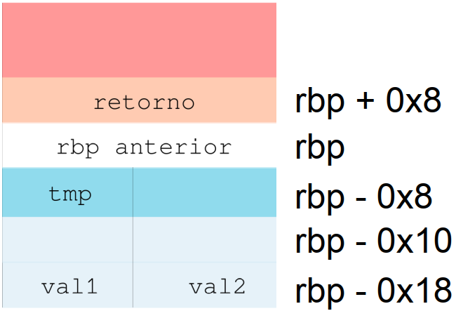

## Sesión II Monitorización del rendimiento en tiempo de ejecución

La tecnología de desarrollo de los compiladores hace hoy posible obtener un alto grado de optimización en el código generado, haciendo completamente innecesario trabajar a nivel ensamblador de forma manual.
Sin embargo, las buenas soluciones siguen lejos de obtenerse con la simple pulsación de un botón. Por ejemplo, muchas de las optimizaciones que puede realizar el compilador deben indicarse expresamente entre los parámetros de la compilación, y no se incluyen como opciones por defecto. En otras ocasiones el patrón de acceso a la memoria utilizado por la aplicación no se adapta a la arquitectura sobre la que debe ejecutarse el código, por lo que la mejora está fuera del alcance del propio compilador.  
El propósito de esta práctica es entender el funcionamiento del compilador y la manera en la que las funciones se ejecutan sobre la arquitectura. Sigue para ello el guion que se describe a continuación, y contesta a cada una de las cuestiones que se remarcan en negrita.

---

##### Objetivos

- Entender la relación entre el código binario del programa y la arquitectura a través del ABI (Application Binary Interface)
- Analizar el efecto de las optimizaciones del compilador sobre el código ensamblador generado

### Ejemplo sencillo

```c
int func(int val1, int val2) {
    int tmp;
    tmp = val1 + val2;
    return tmp;
}
```
Desensamblado resultante de la compilación sin optimización (`-O0`) con `gcc`:

```asm
0000000000000000 <func>:
; Pila para pasar argumentos y variables temporales
int func(int  val1, int val2) {
    00: 55               push %rbp
    01: 48 89 e5         mov %rsp,%rbp
    04: 89 7d ec         mov %edi,-0x14(%rbp)
    07: 89 75 e8         mov %esi,-0x18(%rbp)
    int tmp;
: Cuerpo de la función
  tmp = val1 + val2;
    0a: 8b 55 ec         mov -0x14(%rbp),%edx
    0d: 8b 45 e8         mov -0x18(%rbp),%eax
    10: 01 d0            add %edx,%eax
    12: 89 45 fc         mov %eax,-0x4(%rbp)
; Paso del valor de retorno
  return tmp;
    15: 8b 45 fc         mov -0x4(%rbp),%eax
}
    18: 5d               pop %rbp
    19: c3               retq
```

#### El ejemplo y la pila

<p align="center" width="100%">
  
</p>

1. `00`: Almacena el rbp anterior
2. `01`: rbp apinta a la nueva base
3. `04` y `07`: Copia de los argumentos (`val1` y `val2`) (pasados por registro) a la pila
4. `0a` y `0d`: Lectura de los argumentos desde la pila a registros
5. `10`: Suma
6. `12`: Almacenamiento en la variable local `tmp`
7. `15`: Copia del temporal al registro `%eax`, que debe contener el valor de retorno
8. `18`: Recuperación de la base de pila anterior (se elimina el espacio reservado para la función)

**Póco óptimo:**

- Copia de los argumentos a memoria local innecesaria
- Copia a la variable temporal innecesaria
- Implica muchos accesos extra a memoria

|Lectura de memoria    |Escritura en memoria  |
|:---------------------|:---------------------|
|`00`, `04`, `07`, `12`|`0a`, `0d`, `15`, `18`|

### Caso de estudio: Suma de los elementos de un vector de N posiciones

El código de partida simplemente recorre _una a una_ las posiciones de un vector,  acumulando el resultado sobre una variable total. Este cálculo se repite 100 veces  seguidas.

